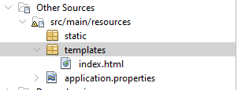
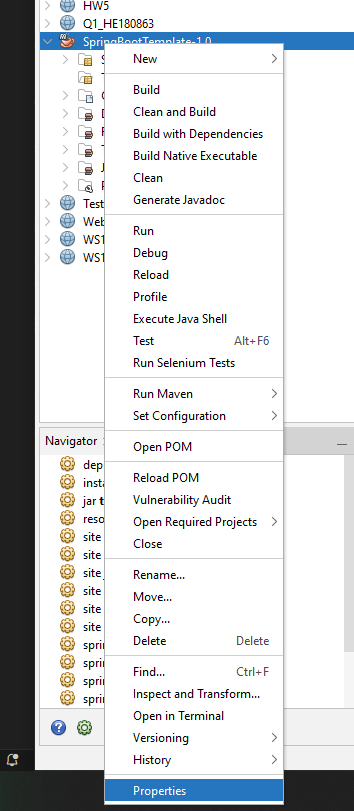
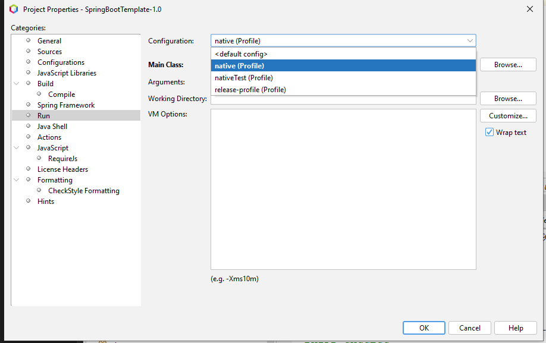
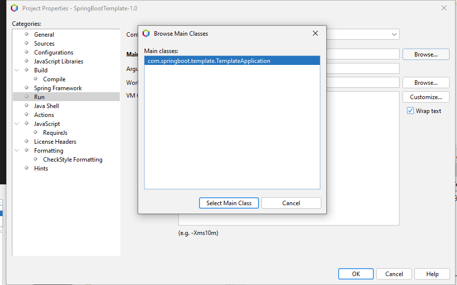

# Hướng dẫn cấu hình SPRING BOOT

Class main là bắt buộc và có cấu hình như file TemplateApplication.java

Tài nguyên được lưu trữ trong mục Other Source

Các file tĩnh như CSS, JS, image lưu trong thư mục static, html lưu trong thư mục templates.

Cấu hình spring nằm trong file application.properties, có thể thêm hoặc sửa nếu cần thiết

chọn main class cho chính xác trước khi chạy
